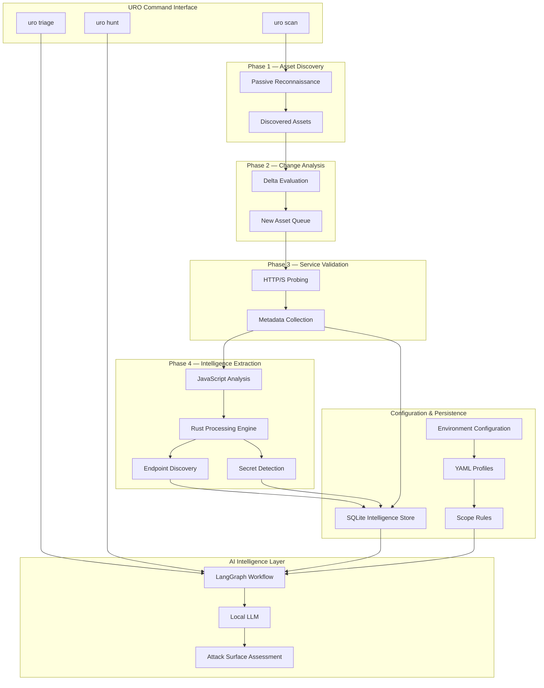

<div align="center">

# UTSU

### Attack Surface Intelligence Platform

Autonomous Reconnaissance • Asset Discovery • JavaScript Intelligence • AI-Assisted Vulnerability Analysis

---

<p align="center">


</p>

### Continuous Discovery. Local Intelligence. Actionable Findings.

URO is a security-focused attack surface intelligence platform designed to continuously discover internet-facing assets, extract application intelligence, and prioritize attack opportunities using local AI-driven analysis.

Built for penetration testers, red teams, security researchers, and enterprise security teams, URO consolidates reconnaissance, enrichment, analysis, and triage into a single automated workflow.

</div>

---

# Executive Summary

Modern organizations operate increasingly complex external attack surfaces spanning cloud infrastructure, web applications, APIs, third-party integrations, and rapidly changing digital assets.

Traditional reconnaissance workflows often rely on fragmented tooling, inconsistent data storage, and manual analysis processes that struggle to scale across large environments.

URO addresses these challenges through a unified intelligence pipeline that:

- Continuously discovers external assets
- Tracks attack surface drift over time
- Identifies exposed application functionality
- Extracts intelligence from JavaScript assets
- Detects secrets and sensitive references
- Generates contextual attack hypotheses using local AI reasoning
- Maintains persistent historical visibility across engagements

Unlike cloud-dependent platforms, URO is designed around a privacy-first architecture where all intelligence collection and AI processing can remain entirely on-premises.

---

# Platform Capabilities

## Continuous Asset Discovery

Perform passive reconnaissance against target domains and maintain a historical inventory of discovered assets.

## Delta-Based Intelligence

Identify newly exposed assets between scans and focus analysis on meaningful environmental changes rather than repeatedly processing known infrastructure.

## Live Service Profiling

Validate discovered assets through HTTP/S probing and collect actionable metadata including:

- Status codes
- Response titles
- Content length
- Redirect chains
- Service fingerprints

## JavaScript Intelligence Engine

Leverage a native Rust-powered analysis engine capable of extracting:

- API endpoints
- Application routes
- Authentication flows
- Cloud service references
- Embedded secrets
- Access tokens
- Configuration artifacts

## AI-Assisted Investigation

Generate contextual attack hypotheses and vulnerability assessments through a LangGraph workflow powered by local Ollama-hosted models.

## Privacy-First Architecture

Maintain complete ownership of reconnaissance data without transmitting assets, secrets, or findings to external AI providers.

---

# Feature Matrix

| Capability | Description |
|------------|-------------|
| Asset Discovery | Passive subdomain enumeration |
| Change Tracking | Delta-aware attack surface monitoring |
| Service Validation | HTTP/S probing and metadata collection |
| JavaScript Intelligence | Endpoint, route and secret extraction |
| Local AI Analysis | Ollama-powered triage workflows |
| Persistent Storage | SQLite intelligence repository |
| Scope Enforcement | Profile-driven engagement controls |
| Offline Operation | No cloud dependency required |
| Native Performance | Rust-powered analysis engine |
| Historical Visibility | Long-term asset tracking |

---

# Reference Architecture

URO follows a modular intelligence lifecycle where each processing stage enriches previously collected data and persists findings into a centralized intelligence repository.



---

# Core Design Principles

## Persistent Intelligence

URO is built around persistent intelligence rather than disposable scan results.

Every discovered asset is tracked historically, enabling operators to identify infrastructure drift and newly exposed attack surface components.

---

## Delta-Driven Processing

Repeated scans avoid unnecessary analysis by processing only newly discovered assets.

This significantly reduces execution time while increasing operational efficiency.

---

## Native Performance

JavaScript analysis represents one of the most computationally intensive stages of reconnaissance.

URO leverages Rust through PyO3 bindings to provide high-performance parsing and extraction capabilities while maintaining Python's orchestration flexibility.

---

## Local AI Processing

All AI workflows can execute locally through Ollama-hosted language models.

Sensitive reconnaissance data never leaves the operator's environment.

---

## Scope-Aware Analysis

Engagement profiles and scope rules are integrated directly into the AI workflow, ensuring generated findings remain aligned with authorized testing boundaries.

---

# Technology Stack

| Layer | Technology |
|---------|-----------|
| Orchestration | Python 3.11+ |
| Performance Engine | Rust 1.78+ |
| Native Bindings | PyO3 |
| Build System | Maturin |
| AI Framework | LangGraph |
| Agent Runtime | LangChain Core |
| Local LLM | Ollama |
| Validation | Pydantic v2 |
| Persistence | SQLite |
| Configuration | YAML + .env |

---

# Project Structure

```text
uro/
│
├── .env.example
├── pyproject.toml
├── Makefile
│
├── src-rust/
│   ├── Cargo.toml
│   └── src/
│       └── lib.rs
│
├── profiles/
│
├── data/
│
└── uro/
    ├── cli/
    ├── core/
    ├── storage/
    ├── probing/
    ├── plugins/
    │   ├── subdomain/
    │   └── js_analysis/
    ├── ai/
    └── __init__.py
```

---

# Getting Started

## Prerequisites

| Requirement | Description |
|------------|-------------|
| Python 3.11+ | Runtime Environment |
| Rust & Cargo | Native Extension Compilation |
| Ollama | Local AI Backend |

---

## Install Ollama

```bash
ollama pull llama3.2
```

Verify installation:

```bash
ollama list
```

---

## Installation

### Clone Repository

```bash
git clone https://github.com/Atsukiiii01/uro.git

cd uro
```

### Create Virtual Environment

```bash
python -m venv venv

source venv/bin/activate

# Windows

venv\Scripts\activate
```

### Configure Environment

```bash
cp .env.example .env
```

### Install Dependencies

```bash
PYO3_USE_ABI3_FORWARD_COMPATIBILITY=1 \
pip install -e ".[ai,dev]"
```

### Verify Installation

```bash
uro --help
```

---

# Configuration

## Global Configuration

The `.env` file controls platform-wide behavior.

```ini
DATABASE_PATH=data/uro.db

OLLAMA_BASE_URL=http://127.0.0.1:11434

DEFAULT_AI_MODEL=llama3.2

DEFAULT_PROBER_THREADS=10
```

---

## Engagement Profiles

Profiles define target-specific execution parameters.

```yaml
name: Example Program

target: example.com

scope_file: scope.txt

threads: 15
```

---

# Operational Workflow

## Phase 1 — Discovery

Discover assets and enrich intelligence.

```bash
uro scan example.com \
-p profiles/example.yaml
```

Capabilities:

- Subdomain Enumeration
- Asset Collection
- Delta Evaluation
- Service Validation
- JavaScript Analysis
- Intelligence Persistence

---

## Phase 2 — Investigation

Analyze a specific target through the AI triage pipeline.

```bash
uro triage \
checkout.example.com \
-p profiles/example.yaml
```

Capabilities:

- Endpoint Analysis
- Secret Correlation
- Attack Path Generation
- Finding Prioritization

---

## Phase 3 — Hunt Mode

Analyze all high-value assets discovered during reconnaissance.

```bash
uro hunt \
-p profiles/example.yaml
```

Capabilities:

- Bulk Triage
- Automated Prioritization
- Vulnerability Hypothesis Generation
- Attack Surface Ranking

---

# Example Workflow

```bash
# Discover assets

uro scan example.com \
-p profiles/example.yaml

# Investigate a target

uro triage api.example.com \
-p profiles/example.yaml

# Hunt across all candidates

uro hunt \
-p profiles/example.yaml
```

---

# Development

## Rebuild Native Extension

```bash
PYO3_USE_ABI3_FORWARD_COMPATIBILITY=1 \
maturin develop --release
```

---

## Python Quality Controls

```bash
ruff check .

ruff format .
```

---

## Rust Quality Controls

```bash
cargo fmt

cargo clippy
```

---

# Security Considerations

## Authorized Use

URO is intended exclusively for:

- Authorized penetration testing
- Security research
- Internal security assessments
- Approved vulnerability disclosure programs

Operators are responsible for ensuring all activities comply with applicable laws, contractual obligations, and program rules.

---

## Data Protection

When deployed with the default Ollama backend, all intelligence processing remains within the operator's environment.

Reconnaissance data, extracted secrets, discovered endpoints, and generated findings are never transmitted to third-party AI providers.

---

## Network Safety Controls

The probing subsystem incorporates safeguards designed to prevent interaction with:

- Localhost Interfaces
- RFC1918 Private Networks
- Cloud Metadata Services
- DNS-Rebinding Targets

Examples include:

```text
127.0.0.1
10.0.0.0/8
172.16.0.0/12
192.168.0.0/16
169.254.169.254
```

---

# Roadmap

### Planned Enhancements

- Distributed Recon Workers
- Cloud Asset Enumeration
- Visual Attack Surface Mapping
- Asset Risk Scoring
- Multi-LLM Support
- Headless Browser Analysis
- API Schema Discovery
- Continuous Monitoring Mode

---

# Why URO?

Modern attack surfaces evolve continuously.

Security teams require more than one-time reconnaissance snapshots. They require persistent visibility, historical context, and actionable intelligence.

URO combines automated discovery, high-performance analysis, and local AI-assisted reasoning into a unified attack surface intelligence platform capable of transforming raw reconnaissance data into meaningful security insights.

---

# License

Licensed under the MIT License.

See the LICENSE file for additional information.

---

### Responsible Disclosure

URO is a security research platform.

Always obtain explicit authorization before conducting testing activities against systems, applications, or infrastructure you do not own.

Unauthorized testing may violate laws, contractual agreements, or program policies.

```
