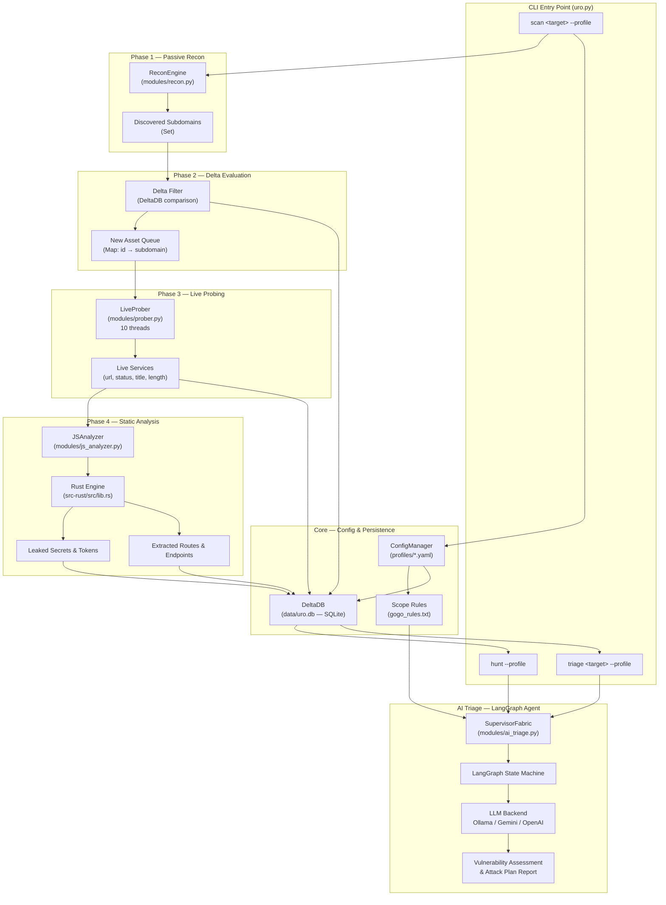

<div align="center">

#  URO

### Asymmetric Attack Surface Management Framework

*Autonomous subdomain discovery · Rust-accelerated JS static analysis · Local LLM-driven vulnerability triage*

---

[](https://python.org)
[](https://rust-lang.org)
[](https://langchain-ai.github.io/langgraph/)
[](LICENSE)
[](https://github.com/Atsukiiii01/uro/issues)
[](https://github.com/Atsukiiii01/uro/stargazers)
[](https://github.com/Atsukiiii01/uro/pulls)
[]()

</div>

---

## Overview

**URO** is an offensive security automation framework built for bug bounty hunters, penetration testers, and security engineers who need to map, probe, and triage an entire external attack surface — without relying on cloud APIs or sending data off-machine.

Traditional recon pipelines fragment across dozens of disconnected tools, lose state between runs, and produce raw output that still demands hours of manual analysis. URO closes that loop by integrating passive subdomain discovery, multi-threaded live probing, bare-metal Rust JS source-map analysis, and a locally-executing LangGraph AI agent into a single, profile-driven CLI.

**Who is it for?**

- **Bug bounty hunters** running structured campaigns against VDP/bug bounty programs with defined scope rules
- **Penetration testers** who need reproducible, delta-aware recon across multiple engagements
- **Security engineers** prototyping automated attack surface monitoring pipelines

**Key benefits:**

- **Offline-first AI** — AI triage runs against a local Ollama model; no data leaves your machine
- **Delta-aware persistence** — SQLite tracks every asset across scans; only *new* deltas are re-probed
- **Polyglot performance** — Python orchestrates the pipeline; Rust handles CPU-intensive JS parsing at native speed
- **Scope-constrained reasoning** — YAML profiles and plaintext scope rules feed the AI agent so it only flags findings valid under a program's bug bounty rules
- **Three commands, full pipeline** — `scan`, `triage`, and `hunt` cover discovery through report-ready AI output

---

## Features

| Feature | Description | Status |
|---|---|---|
| **Passive Subdomain Enumeration** | Multi-source reconnaissance via `ReconEngine` to surface the full subdomain footprint | ✅ Stable |
| **Delta-Aware Asset Tracking** | SQLite-backed `DeltaDB` persists scan state; only net-new assets enter the execution queue | ✅ Stable |
| **Async Live Probing** | Multi-threaded `LiveProber` HTTP/S probing with title, status, and content-length extraction | ✅ Stable |
| **Rust JS Source-Map Analysis** | Native Rust library (`src-rust/`) parses bundled JavaScript for exposed routes, API paths, and hardcoded secrets at high throughput | ✅ Stable |
| **LangGraph AI Triage Agent** | `SupervisorFabric` orchestrates a LangGraph state machine that reasons over extracted intel and generates structured vulnerability attack plans | ✅ Stable |
| **Multi-Model LLM Support** | Supports Ollama (local), Google Gemini, and OpenAI as interchangeable backends via LangChain | ✅ Stable |
| **Scope-Constrained Assessment** | Per-profile scope rules (`gogo_rules.txt` pattern) constrain AI output to valid, in-scope findings | ✅ Stable |
| **Batch Hunt Mode** | `hunt` command auto-queues all live services with extracted intel for AI triage in a single pass | ✅ Stable |
| **YAML Operational Profiles** | Declarative profiles (`profiles/*.yaml`) bind target, toolchain settings, and scope file per engagement | ✅ Stable |
| **Secret & Credential Detection** | Identifies hardcoded API keys, tokens, and credentials leaked in JS bundles | ✅ Stable |
| **Structured SQLite Output** | All findings (domains, subdomains, web services, endpoints, secrets) stored in a normalized relational schema | ✅ Stable |
| **Python × Rust FFI Bridge** | `tool_wrapper.py` exposes the compiled Rust library to the Python pipeline via native bindings | 🔧 Evolving |

---

## Architecture

URO is organized as a four-phase sequential pipeline that accumulates intelligence in a persistent SQLite store between runs. Each phase is independently auditable and can be re-run without discarding prior data.



### Design Decisions

**Delta persistence over stateless re-scanning.** `DeltaDB` inserts new subdomains and updates `last_seen` timestamps for known ones. This means repeat scans against the same target are fast and idiomatic — only genuinely new assets incur the cost of probing and JS analysis.

**Rust for the CPU-bound hot path.** JavaScript bundle parsing — AST walking, regex pattern matching across megabyte-scale files, source-map reconstruction — is inherently CPU-intensive. Offloading this to a compiled Rust library (`src-rust/`) delivers an order-of-magnitude speedup over a pure-Python equivalent while keeping the orchestration layer readable Python.

**Local LLM over cloud APIs.** The AI triage agent defaults to Ollama so that sensitive reconnaissance data (hostnames, leaked credentials, internal paths) never transits a third-party API. Cloud models (Gemini, OpenAI) are supported for operators who accept that tradeoff.

**Profile-driven scope enforcement.** Every run is bound to a YAML profile that declares the target and optionally references a plaintext scope file. The scope file is injected verbatim into the AI agent's system prompt, preventing it from hallucinating out-of-scope findings.

---

## Tech Stack

| Category | Technologies |
|---|---|
| **Orchestration Language** | Python 3.11+ |
| **Performance Core** | Rust 1.78+ (compiled library via `src-rust/`) |
| **AI / LLM Framework** | LangChain Core, LangGraph, LangSmith |
| **LLM Backends** | Ollama (local), Google Gemini (`langchain-google-genai`), OpenAI (`langchain-openai`) |
| **Async HTTP** | `httpx`, `requests` |
| **Data Validation** | Pydantic v2 |
| **Persistence** | SQLite (via Python `sqlite3`) |
| **Serialization** | `orjson`, `ormsgpack`, `PyYAML` |
| **Cryptography** | `cryptography` (PyCA) |
| **Build System (Rust)** | Cargo |
| **Configuration** | YAML profiles + plaintext scope rules |
| **Testing** | Native Python test scripts (`test_ai.py`) |
| **CI/CD** | GitHub Actions (workflow pending) |

---

## Project Structure

```
uro/
├── core/                       # Foundational services shared across all modules
│   ├── __init__.py
│   ├── config.py               # ConfigManager — loads and validates YAML profiles
│   ├── database.py             # DeltaDB — SQLite ORM, schema init, delta tracking
│   └── tool_wrapper.py         # FFI bridge exposing the Rust library to Python
│
├── modules/                    # Discrete pipeline stages
│   ├── __init__.py
│   ├── recon.py                # ReconEngine — passive subdomain discovery
│   ├── prober.py               # LiveProber — concurrent HTTP/S probing
│   ├── js_analyzer.py          # JSAnalyzer — orchestrates Rust JS analysis + result parsing
│   └── ai_triage.py            # SupervisorFabric / AITriageAgent — LangGraph state machine
│
├── profiles/                   # Per-engagement operational profiles (YAML)
│   └── gogo.yaml               # Example: Gogo VDP engagement profile
│
├── src-rust/                   # Rust crate — native JS source-map analysis engine
│   ├── src/
│   │   └── lib.rs              # Core Rust library (route extraction, secret detection)
│   ├── Cargo.toml              # Rust package manifest and dependencies
│   └── Cargo.lock              # Pinned dependency lockfile
│
├── data/                       # Runtime data directory (created on first run)
│   ├── unpacked/               # Temporary working directory for JS bundle unpacking
│   └── uro.db                  # SQLite database — all scan state and findings
│
├── uro.py                      # Primary CLI entry point (scan / triage / hunt commands)
├── main.py                     # Legacy entry point (direct execution, no profiles)
├── test_ai.py                  # Integration test harness for the AI triage agent
├── gogo_rules.txt              # Example scope rules file (Gogo VDP)
├── requirements.txt            # Python dependency manifest (pinned)
└── .gitignore
```

**Key directories explained:**

`core/` contains the two services every module depends on: `ConfigManager` (profile loading) and `DeltaDB` (the persistent state store). Neither module has side effects on import; both are explicitly instantiated.

`modules/` implements the four pipeline phases as independent, testable classes. Each module takes only the data it needs and writes results back through `DeltaDB`, keeping coupling minimal.

`src-rust/` is a Cargo library crate compiled to a native shared library and called from `core/tool_wrapper.py`. The Rust code performs the computationally expensive work (bundle parsing, pattern matching) and returns structured JSON that Python consumes.

`profiles/` stores per-engagement YAML files that bind a target domain, LLM backend configuration, and an optional scope file path.

---

## Getting Started

### Prerequisites

| Requirement | Version | Notes |
|---|---|---|
| **Python** | 3.11+ | Earlier versions untested |
| **Rust / Cargo** | 1.78+ | Required to compile the Rust analysis engine |
| **Ollama** | Latest | Required for local LLM triage (or substitute Gemini/OpenAI) |

Install Ollama and pull a model before running triage:

```bash
# Install Ollama: https://ollama.com/download
ollama pull llama3          # or mistral, codellama, etc.
```

### Installation

```bash
# 1. Clone the repository
git clone https://github.com/Atsukiiii01/uro.git
cd uro

# 2. Create and activate a virtual environment
python -m venv venv
source venv/bin/activate          # Windows: venv\Scripts\activate

# 3. Install Python dependencies
pip install -r requirements.txt

# 4. Build the Rust JS analysis engine
cd src-rust
cargo build --release
cd ..

# 5. Verify the installation
python uro.py --help
```

> **Note:** The `data/` directory and `uro.db` SQLite database are created automatically on the first scan run. No manual schema migration is required.

### Environment Variables

URO is primarily configured via YAML profiles rather than environment variables. The following variables are only needed when using cloud LLM backends:

| Variable | Description | Required |
|---|---|---|
| `GOOGLE_API_KEY` | Google AI Studio API key — required when using Gemini as the LLM backend | Only for Gemini |
| `OPENAI_API_KEY` | OpenAI API key — required when using GPT-4o or other OpenAI models | Only for OpenAI |
| `LANGCHAIN_API_KEY` | LangSmith API key — optional, enables LangSmith tracing for agent observability | No |
| `LANGCHAIN_TRACING_V2` | Set to `"true"` to enable LangSmith trace collection | No |
| `OLLAMA_HOST` | Override the Ollama server URL (default: `http://localhost:11434`) | No |

---

## Configuration

### YAML Operational Profile

Every scan and triage command requires a `--profile` pointing to a YAML configuration file. Profiles are the primary mechanism for managing multi-target engagements.

```yaml
# profiles/example.yaml

target: example.com

llm:
  backend: ollama          # Options: ollama | gemini | openai
  model: llama3            # Model name as understood by the selected backend

scope_file: gogo_rules.txt # Path to plaintext scope constraints (optional)

prober:
  threads: 10              # Concurrent HTTP probe workers
  timeout: 10              # Per-request timeout in seconds
```

### Scope Rules File

Scope files are plaintext documents injected directly into the AI triage agent's system context. They follow the format used by bug bounty VDP programs and instruct the agent about:

- **Target environment** — what systems are in scope
- **Strict exclusions** — finding types that should not be reported
- **Priority vulnerabilities** — issue classes the program considers high-value

See `gogo_rules.txt` in the repository root for a complete working example targeting an aviation technology VDP.

### Database Schema

URO uses a normalized SQLite schema maintained by `DeltaDB`. On first run the following tables are created automatically:

| Table | Purpose |
|---|---|
| `domains` | Root target domains |
| `subdomains` | Discovered subdomains with `first_seen` / `last_seen` timestamps |
| `web_services` | Live HTTP/S services: URL, status code, content length, page title |
| `endpoints` | Client-side routes and API paths extracted from JS bundles |
| `leaked_secrets` | High-entropy tokens, API keys, and credentials found in JS source |

---

## Usage

### Basic Workflow: Scan → Triage → Hunt

**Step 1 — Full discovery and JS intelligence extraction:**

```bash
python uro.py scan example.com --profile profiles/example.yaml
```

This executes all four phases: passive recon, delta evaluation, live probing, and JS static analysis. Results are committed to `data/uro.db`.

**Step 2 — AI triage on a specific target:**

```bash
python uro.py triage example.com --profile profiles/example.yaml
```

Loads all extracted intel for `example.com` from the database and runs the LangGraph triage agent, producing a structured vulnerability assessment and prioritized attack plan.

**Step 3 — Batch triage all viable targets:**

```bash
python uro.py hunt --profile profiles/example.yaml
```

Queries the database for all live services with `status_code IN (200, 401, 403)` that have associated endpoints or leaked secrets, then runs the AI triage agent against each in sequence. This is the primary mode for end-of-scan automation.

---

### Advanced Examples

**Running a scan with a custom thread count (override in profile):**

```bash
# Edit profiles/fast.yaml with prober.threads: 25
python uro.py scan target.com --profile profiles/fast.yaml
```

**Isolated AI triage test (development / model evaluation):**

```bash
# Requires at least one completed scan in the database
python test_ai.py
```

This runs the triage agent against the first web service with extracted endpoints in `uro.db` and prints the raw agent report, useful for evaluating model output quality before a full `hunt`.

**Re-scanning an existing target (only new assets probed):**

```bash
# Run scan again against the same target — DeltaDB deduplicates
python uro.py scan example.com --profile profiles/example.yaml
# Output: only NEW DELTA assets enter the prober queue
```

---

### Typical Bug Bounty Workflow

```
1. Create a profile for the program (copy profiles/gogo.yaml as a template)
2. Write a scope rules file matching the program's VDP policy
3. Run: python uro.py scan <root_domain> --profile profiles/<program>.yaml
4. Review delta output — new subdomains, live services, extracted JS secrets
5. Run: python uro.py hunt --profile profiles/<program>.yaml
6. Review AI-generated attack plan for each viable target
7. Manually validate AI-suggested attack paths before reporting
```

---

## Development

### Local Development Setup

```bash
git clone https://github.com/Atsukiiii01/uro.git
cd uro
python -m venv venv && source venv/bin/activate
pip install -r requirements.txt
cd src-rust && cargo build && cd ..
```

### Running Tests

```bash
# Integration test — AI triage agent against local database
# (requires a prior scan to populate data/uro.db)
python test_ai.py
```

### Building the Rust Engine

```bash
cd src-rust

# Development build (faster compile, unoptimized)
cargo build

# Release build (optimized, used in production)
cargo build --release

# Run Rust unit tests
cargo test
```

The compiled `.so` / `.dylib` / `.dll` is placed in `src-rust/target/release/` and referenced by `core/tool_wrapper.py`.

### Code Style

```bash
# Python formatting (Black)
black .

# Python linting (Ruff)
ruff check .

# Rust formatting
cd src-rust && cargo fmt

# Rust linting
cd src-rust && cargo clippy
```

### Adding a New Module

1. Create `modules/your_module.py` implementing a single well-named class
2. Accept `target` and optionally a `DeltaDB` instance in `__init__`
3. Expose a `run()` method that returns structured data
4. Register the phase in `uro.py` within the appropriate `cmd_*` function
5. Write results through `DeltaDB` to maintain delta consistency

---

## Deployment

### Self-Hosted (Recommended)

URO is designed as an operator-local tool. The recommended deployment is a direct clone on a Linux or macOS machine with network access to the target scope.

```bash
# Production run from a dedicated recon machine
git clone https://github.com/Atsukiiii01/uro.git
cd uro
python -m venv venv && source venv/bin/activate
pip install -r requirements.txt
cd src-rust && cargo build --release && cd ..
ollama pull llama3

# Persistent engagement
nohup python uro.py scan target.com --profile profiles/target.yaml > logs/scan.log 2>&1 &
```

### Docker (Community Contribution Opportunity)

A Docker image is not yet published. A minimal `Dockerfile` would need to:

1. Use `python:3.11-slim` as the base
2. Install Rust via `rustup` and compile `src-rust/`
3. Install Ollama or mount an external Ollama socket
4. Run `pip install -r requirements.txt`

Pull requests adding Docker support are welcome — see **Contributing** below.

### VPS / Cloud Deployment

For long-running campaigns, a VPS deployment with a persistent volume for `data/uro.db` is recommended:

```bash
# Mount a persistent block volume at /opt/uro/data
# so scan state survives instance restarts
python uro.py scan target.com --profile profiles/target.yaml
# data/uro.db accumulates deltas across sessions
```

---

## Performance Considerations

### Scalability

The pipeline is currently sequential across the four phases. Phase 3 (live probing) uses a configurable thread pool (`LiveProber(threads=N)`). For large programs with thousands of subdomains, increasing `prober.threads` in the profile (up to ~50 is generally safe) reduces Phase 3 wall time significantly.

Phase 4 (JS analysis) is serialized per-service but is CPU-bound in Rust, so it benefits from fast hardware clocks rather than more threads.

### Delta Deduplication

The `DeltaDB` delta filter is the primary performance primitive for repeat runs. Once a subdomain is recorded, it is skipped by the prober on all subsequent scans unless it is first removed from the database. This makes re-scanning a large program very fast after the initial discovery.

### LLM Triage Throughput

`hunt` mode processes targets sequentially. For programs with hundreds of viable targets, AI triage time is dominated by the LLM's token generation speed. Local Ollama models (e.g., `llama3:8b` on a GPU) handle this well; for very large batches, consider rate-limiting cloud API calls or running overnight.

### Caching

Rust JS parse results are not currently cached to disk — they are re-parsed on each `scan` invocation for a given service. Caching parsed bundle outputs per URL hash is a planned optimization.

---

## Security

### Intended Use — Authorized Testing Only

URO is built exclusively for security assessments conducted with **explicit written authorization** from the target organization, or against assets within a bug bounty program's declared scope. Unauthorized use against systems you do not own or have explicit permission to test is illegal and unethical.

### Secrets and API Key Handling

- API keys for cloud LLM backends (`GOOGLE_API_KEY`, `OPENAI_API_KEY`) must be set as environment variables — never commit them to your profile YAML files or to source control.
- The `.gitignore` already excludes `data/` to prevent accidental commit of the SQLite database, which may contain sensitive reconnaissance data (leaked credentials, internal hostnames).
- Scope rule files may contain details about a target's internal systems; treat them as sensitive and do not commit program-specific files to public forks.

### Data Locality

When using the Ollama backend, all data processed by the AI agent — including extracted secrets, internal endpoints, and subdomain lists — stays on-machine. When using Gemini or OpenAI backends, this data is transmitted to the respective cloud API endpoint. Choose your backend accordingly based on your engagement's data handling requirements.

### No Persistence of Plaintext Secrets

`DeltaDB` stores the type, value, and source location of detected secrets in `leaked_secrets`. Treat `data/uro.db` as a sensitive artifact: encrypt it at rest, restrict file permissions, and delete it when the engagement closes.

```bash
chmod 600 data/uro.db
```

---

## Contributing

Contributions are welcome. Please follow standard open-source etiquette and keep pull requests focused.

### Contribution Workflow

1. **Fork** the repository and create your branch from `main`:

```bash
git checkout -b feature/your-feature-name
```

2. **Implement** your change. For new modules, follow the patterns established in `modules/recon.py` and `modules/prober.py`.

3. **Test** your change against a real or mock target:

```bash
python uro.py scan testfire.net --profile profiles/your-test-profile.yaml
```

4. **Format and lint** your code:

```bash
black . && ruff check .
# For Rust changes:
cd src-rust && cargo fmt && cargo clippy
```

5. **Commit** with a conventional commit message:

```bash
git commit -m "feat(modules): add certificate transparency log source to ReconEngine"
```

6. **Push** and open a **Pull Request** against `main`. Fill in the PR template describing what you changed and why.

### Good First Contributions

- Add Docker / `docker-compose.yml` support
- Implement certificate transparency log (crt.sh) source in `ReconEngine`
- Add Nuclei template execution as an optional Phase 5
- Write a proper `pytest` test suite replacing `test_ai.py`
- Add output formatters (JSON, HTML report, Markdown summary)
- Implement parallel AI triage using `asyncio` in `hunt` mode

---

## Roadmap

The following milestones reflect the natural evolution of the codebase based on its current architecture:

### v0.2 — Hardened Pipeline
- [ ] Replace `test_ai.py` with a proper `pytest` suite with mocked LLM responses
- [ ] Docker image with bundled Ollama support
- [ ] Parallel async `hunt` mode using `asyncio.gather`
- [ ] Nuclei template integration as optional Phase 5

### v0.3 — Expanded Intelligence
- [ ] Certificate transparency log (crt.sh) subdomain source
- [ ] Shodan / FOFA integration for service fingerprinting
- [ ] JavaScript source-map reconstruction (`.map` file resolution)
- [ ] HTTP parameter discovery from JS route extraction

### v0.4 — Reporting & Export
- [ ] HTML vulnerability assessment report generator
- [ ] JSON and Markdown finding exporters
- [ ] HackerOne / Bugcrowd report template auto-generation from AI output
- [ ] Per-engagement finding deduplication across multiple scans

### v1.0 — Production-Grade ASM
- [ ] Continuous monitoring mode with webhook alerting on new deltas
- [ ] Multi-target profile orchestration
- [ ] Web UI for database browsing and finding review
- [ ] Plugin architecture for third-party module integration

---

## Troubleshooting

### Common Issues

**`ModuleNotFoundError: No module named 'core'`**

Run URO from the repository root, not from a subdirectory:

```bash
cd /path/to/uro
python uro.py scan ...
```

---

**`[-] Target <domain> not found in database. Run 'scan' first.`**

The `triage` and `hunt` commands read from `data/uro.db`. You must run a `scan` first to populate the database before triaging:

```bash
python uro.py scan target.com --profile profiles/target.yaml
python uro.py triage target.com --profile profiles/target.yaml
```

---

**`ollama: connection refused` / LLM triage fails with connection error**

Ollama is not running. Start it before invoking triage:

```bash
ollama serve &
ollama pull llama3
python uro.py hunt --profile profiles/target.yaml
```

---

**Rust build fails: `error[E0463]: can't find crate for ...`**

Dependencies are missing. Run `cargo build --release` inside `src-rust/` to fetch and compile all Cargo dependencies:

```bash
cd src-rust
cargo build --release
```

---

**`[*] No new assets require probing or static code analysis.`**

All discovered subdomains already exist in `data/uro.db`. This is expected behavior — URO only probes new deltas. To force a full re-probe, either delete the database or remove the specific subdomain records:

```bash
# Full reset
rm data/uro.db
python uro.py scan target.com --profile profiles/target.yaml
```

---

**Phase 4 shows `[!] CRITICAL: Found N potential hardcoded credentials!` but triage does not flag them**

Verify that the AI agent is loading your scope file correctly by checking the log output for `Loaded AI scope constraints from: <path>`. If the path is incorrect, fix `scope_file` in your YAML profile.

---

**High memory usage during JS analysis**

Large JavaScript bundles (> 5 MB) can consume significant memory during parsing. If memory is constrained, reduce the number of concurrent services analyzed by lowering `prober.threads`, which controls how many services enter the Phase 4 queue per scan.

---

## License

This project is licensed under the **MIT License**. See [`LICENSE`](LICENSE) for the full text.

> **Responsible Disclosure:** URO is an offensive security tool. The MIT license grants broad freedom to use and modify this software, but does not grant permission to use it against systems without authorization. Users are solely responsible for ensuring their use complies with applicable laws and bug bounty program rules.

---

## Acknowledgements

URO is built on the shoulders of exceptional open-source projects:

- [**LangChain**](https://github.com/langchain-ai/langchain) — The LLM application framework powering the triage agent
- [**LangGraph**](https://github.com/langchain-ai/langgraph) — Stateful multi-step agent orchestration
- [**Ollama**](https://github.com/ollama/ollama) — Local LLM runtime that keeps recon data off the internet
- [**Pydantic**](https://github.com/pydantic/pydantic) — Data validation backbone
- [**httpx**](https://github.com/encode/httpx) — Modern async HTTP client
- [**Rust**](https://www.rust-lang.org/) — Systems language enabling native-speed JS analysis

---

## Maintainers

| Name | GitHub | Role |
|---|---|---|
| **Atsukiiii01** | [@Atsukiiii01](https://github.com/Atsukiiii01) | Author & Lead Maintainer |

---

<div align="center">

**URO** is built for authorized security research. Always obtain proper written permission before testing any system.

*If you find this tool useful, consider starring the repository and opening issues or PRs.*

[](https://github.com/Atsukiiii01/uro)

</div>
